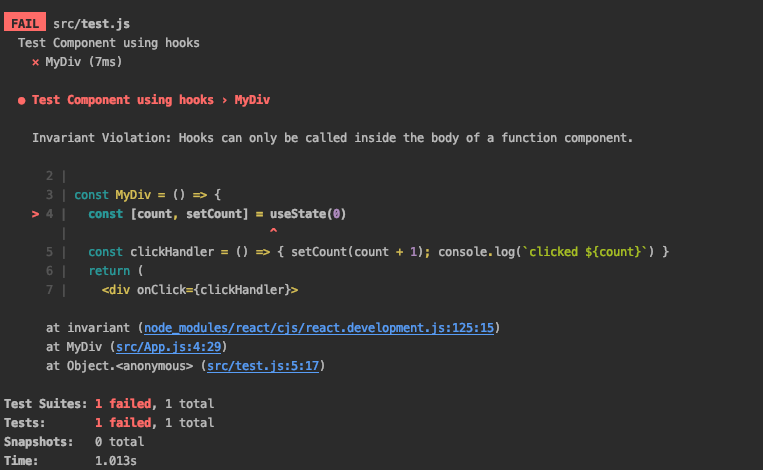

# basic react hooks example with a failing jest unit test.

**Invariant Violation: Hooks can only be called inside the body of a function component.**

[hooks](https://reactjs.org/docs/hooks-intro.html) are only beta use at the moment. They obviously work but the above
error (Invariant violation) is seen when attempting to write a unit test. I am now at a loss about what to try next.

